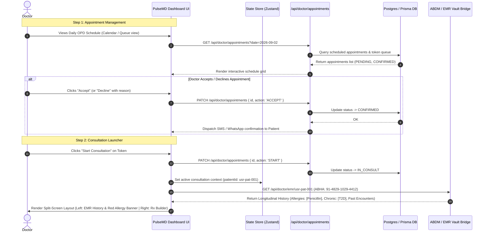
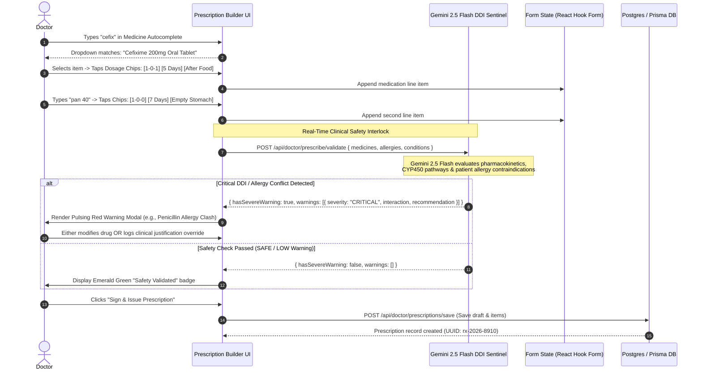
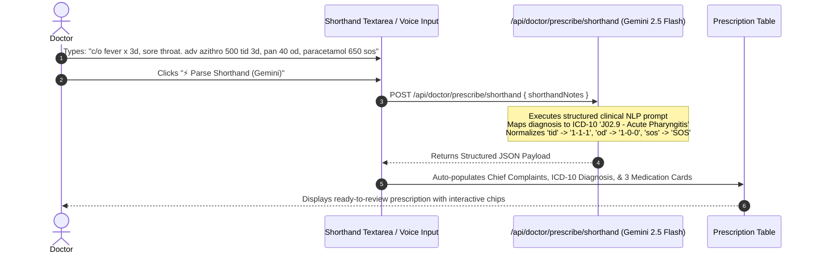
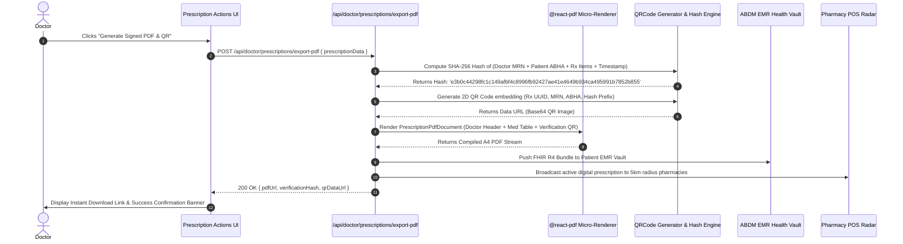

# Workflow Specification: Doctor & Clinic Module (PulseMD)

**Document Version:** 1.0.0  
**Author:** AGENT 2 (PulseMD Lead Engineer)  
**Target Release:** MVP / Q3 2026  
**Standard Compliance:** HIPAA, DISHA, HL7 FHIR Release 4, ABDM (M1/M2/M3), National Medical Commission (NMC)  

---

## 1. Workflow 1: Appointment Lifecycle & Consultation Intake

This workflow defines the operational state transitions for patient scheduling, queue summoning, and automatic EMR longitudinal history hydration.



### Appointment Lifecycle State Machine
```
   [PENDING]
     │
     ├───(Doctor Declines)───────────► [CANCELLED] (Reason Logged)
     │
     └───(Doctor Accepts)────────────► [CONFIRMED]
                                          │
    ┌─────────────────────────────────────┴─────────────────────────────────────┐
    │ (Rescheduled by Doctor/Patient)                                           │ (Doctor summons Token)
    ▼                                                                           ▼
[RESCHEDULED] ───► [CONFIRMED]                                            [IN_CONSULT]
                                                                                │
                                                                                │ (Prescription Signed)
                                                                                ▼
                                                                           [COMPLETED]
```

---

## 2. Workflow 2: Rapid Digital Prescription Authoring & Gemini DDI Sentinel

This workflow details the high-speed prescription creation loop, integrating rapid-tap dosage chips, ICD-10 diagnostic tagging, and real-time **Google Gemini 2.5 Flash** Drug-Drug Interaction (DDI) & allergy validation.



---

## 3. Workflow 3: Shorthand Clinical Notes Natural Language Parser

This workflow illustrates how doctors can dictate or type unstructured clinical shorthand, allowing **Google Gemini 2.5 Flash** to automatically construct structured prescription cards.



---

## 4. Workflow 4: Cryptographic PDF & Offline Verification QR Flow

This workflow illustrates the compilation of the digital prescription into an immutable, verifiable PDF document and an offline QR token for retail pharmacy dispensing.



---

## 5. State Machine: Clinical DDI Safety Sentinel

```
                 [DRAFTING MEDICINES]
                          │
                          │ (User adds/modifies drug)
                          ▼
            [GEMINI SENTINEL EVALUATING]
                          │
          ┌───────────────┴───────────────┐
          │ (No severe clashes)           │ (Severe conflict found)
          ▼                               ▼
 [STATUS: SAFE / LOW]            [STATUS: CRITICAL WARNING]
          │                               │
          │                               ├───(Doctor adjusts drug)───► [DRAFTING]
          │                               │
          │                               └───(Doctor logs Clinical Override)
          │                                           │
          └───────────────────────┬───────────────────┘
                                  │
                                  ▼
                    [READY FOR DIGITAL SIGNATURE]
```
