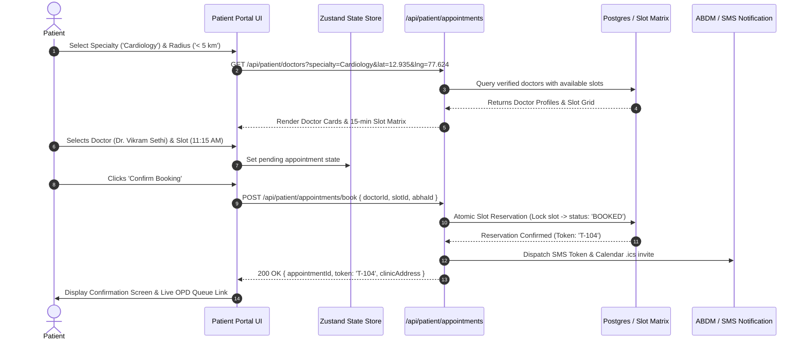
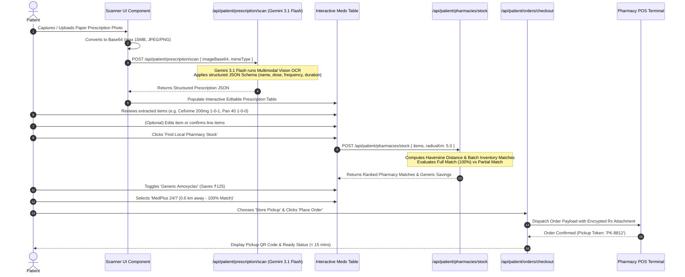
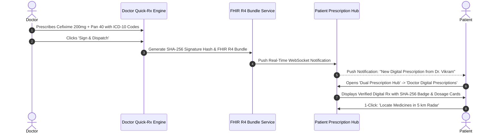
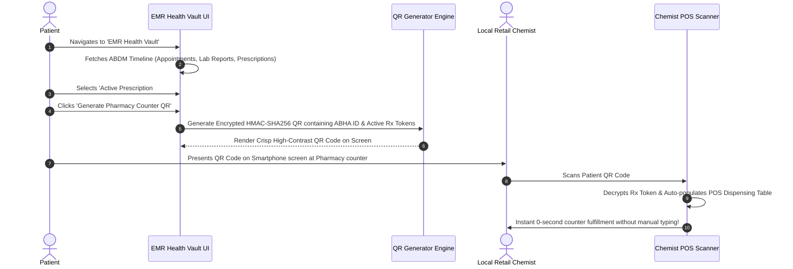
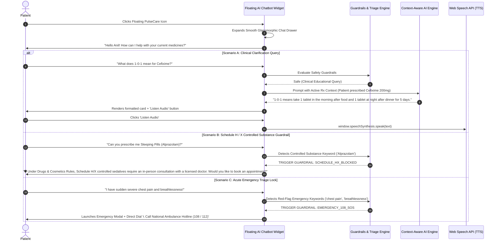

# Workflow Specification: Patient Module (PulseCare)

**Document Version:** 1.0.0  
**Author:** AGENT 1 (PulseCare Lead Engineer)  
**Target Release:** MVP (Q3 2026)  
**Standard Compliance:** HIPAA, DISHA, FHIR Release 4, ABDM (M1/M2/M3)  

---

## 1. Workflow 1: Doctor Discovery & Real-Time Slot Booking



### State Machine: Appointment Lifecycle
```
[AVAILABLE] 
   │ (Patient initiates booking)
   ▼
[LOCKED] ───(5 min timeout)───► [AVAILABLE]
   │ (Payment / Confirmation)
   ▼
[BOOKED] 
   │ (Doctor summons token in OPD)
   ▼
[IN_PROGRESS] 
   │ (Consultation concluded)
   ▼
[COMPLETED] ───► (Auto-generates EMR Vault Record)
```

---

## 2. Workflow 2: Smart Prescription Scanner & Local Pharmacy Order Flow

This workflow illustrates the core AI-powered loop: capturing a physical paper prescription, converting cursive handwriting to structured JSON via **Google Gemini 3.1 Flash**, matching stock within 5 km, and placing a direct order.



---

## 3. Workflow 3: Dual Hub - Doctor Digital FHIR Prescription Lifecycle

When a consultation happens directly on the Nexora platform, the doctor issues a digitally signed FHIR R4 prescription that instantly appears in the patient's portal.



---

## 4. Workflow 4: EMR Longitudinal Health Vault & Offline QR Dispensing



---

## 5. Workflow 5: Persistent PulseCare Floating AI Chatbot

The **PulseCare AI Chatbot** remains anchored in the bottom-right corner of every screen in the patient portal. It dynamically injects the patient's active prescription context while strictly enforcing regulatory guardrails.



---

## 6. End-to-End Error Handling & Offline Fallback Strategy

| Failure Scenario | Recovery & Fallback Mechanism |
| :--- | :--- |
| **Gemini Vision OCR Network Timeout ($> 5\text{s}$)** | Client-side exponential retry (up to 2 retries). If still unreachable, smoothly falls back to a manual entry form with pre-populated common formulary autocomplete. |
| **Ambiguous or Illegible Cursive Handwriting** | Extracted items with $< 70\%$ confidence are tagged with an Amber/Red badge prompting the user: *"Please verify dosage with your pharmacist before ordering."* |
| **Offline Connectivity in Pharmacy** | Progressive Web App (PWA) cache serves the patient's QR code and cached PDF prescription from IndexedDB even with 0 internet connection. |
| **Zero Inventory in 5 km Radius** | System automatically expands the search radius in 2 km increments up to 15 km, or provides a 1-click option to split the order across two nearby stores. |
