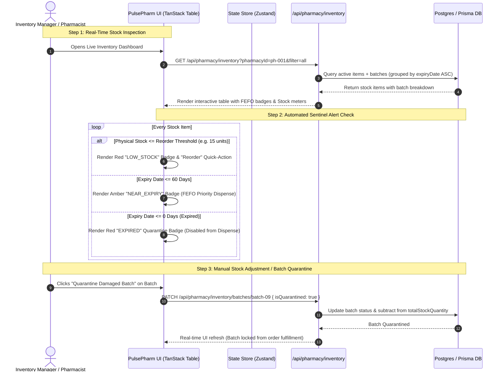
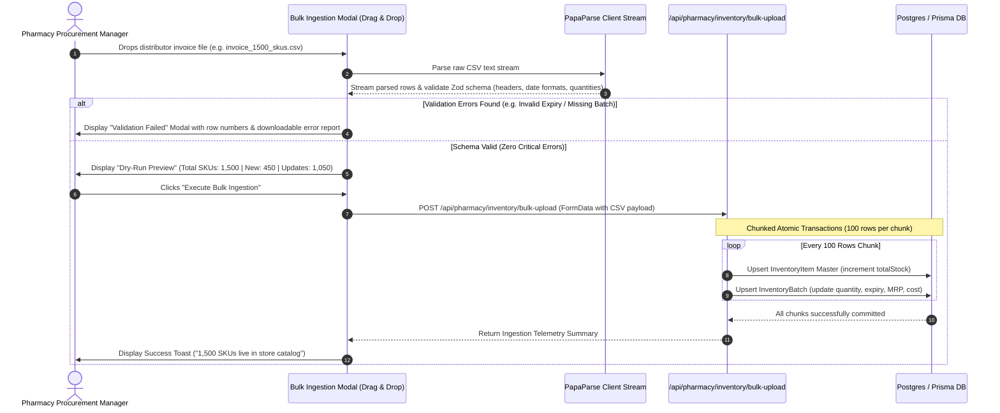
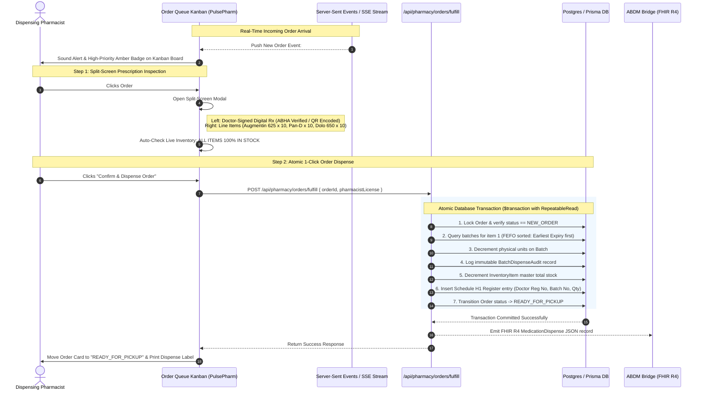
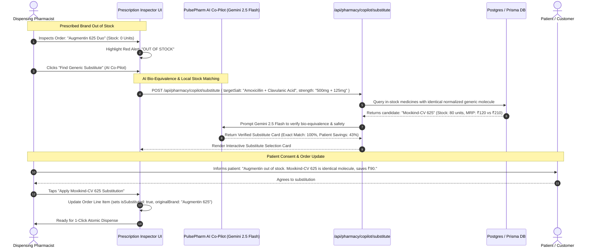

# Workflow Specification: Pharmacy Module (PulsePharm)

**Document Version:** 1.0.0  
**Author:** AGENT 3 (PulsePharm Lead Engineer)  
**Target Release:** MVP / Q3 2026  
**Standard Compliance:** Drugs and Cosmetics Act 1940 / Rules 1945 (Schedule H/H1/X), CDSCO, ABDM (M1/M2/M3), HL7 FHIR Release 4 (`MedicationDispense`)  

---

## 1. Workflow 1: Live Inventory Management & FEFO Stock Lifecycle

This workflow governs real-time stock inspection, batch tracking, automated First-Expiry-First-Out (FEFO) ordering, and proactive low-stock/near-expiry alert management.



---

## 2. Workflow 2: Bulk CSV / Excel Ingestion & Batch Upsert Pipeline

This workflow defines the ingestion of distributor stock spreadsheets, client-side streaming parsing, column validation, dry-run previews, and atomic chunked database upserts.



---

## 3. Workflow 3: Prescription-Linked Order Queue & Atomic Fulfillment

This workflow outlines the core dispensing process: receiving real-time digital prescriptions (or patient OCR slips), verifying stock availability, inspecting prescription details in split-screen, and executing atomic inventory decrement.



### Order Fulfillment State Machine
```
   [NEW_ORDER]
        │
        ├───(Stock Unavailable / Prescriber Reject)────► [CANCELLED] (Reason Logged)
        │
        └───(Pharmacist Verifies Stock & Accepts)─────► [PREPARING]
                                                             │
                                                             │ (1-Click Atomic Dispense & Stock Decrement)
                                                             ▼
                                                    [READY_FOR_PICKUP]
                                                             │
                                   ┌─────────────────────────┴─────────────────────────┐
                                   │ (In-Store Patient Pickup)                         │ (Home Delivery Dispatch)
                                   ▼                                                   ▼
                              [COMPLETED]                                     [OUT_FOR_DELIVERY]
                                                                                       │
                                                                                       │ (Proof of Delivery)
                                                                                       ▼
                                                                                  [COMPLETED]
```

---

## 4. Workflow 4: Smart Generic Salt Substitution & Out-of-Stock Resolution

This workflow details how the **PulsePharm Operational Co-Pilot (Gemini AI)** resolves out-of-stock scenarios by recommending chemical bio-equivalent generic alternatives with cost-benefit transparency.


